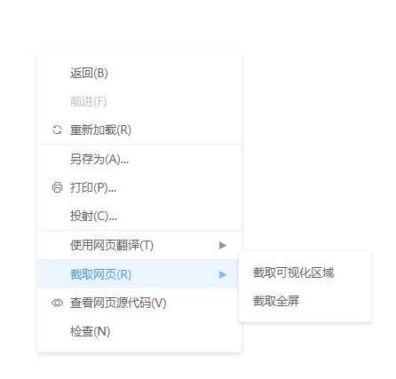

# Vue Contextmenu


Vue 原生实现右键菜单组件, 零依赖




# 在线演示
- [事件演示](https://codepen.io/laziji/pen/vYEZebK)
- [简单复制粘贴演示](https://codepen.io/laziji/pen/povWLYq)


# 快速安装

## npm 安装
```
npm install vue-contextmenujs
```
或
```
yarn add vue-contextmenujs
```

## CDN
```html
<script src="https://unpkg.com/vue-contextmenujs/dist/contextmenu.umd.js">
```


# 使用
CDN引入则不需要 `Vue.use(Contextmenu)`
> 测试中使用的是`element-ui`图标
```js
import Contextmenu from "vue-contextmenujs"
Vue.use(Contextmenu);


// 在组件中调用显示菜单
// this.$contextmenu(options:MenuOptions);
// 鼠标点击或滚轮自动销毁, 也可手动销毁
// this.$contextmenu.destroy();

// 去除浏览器默认菜单
// event.preventDefault();
```


```html
<template>
  <div id="app" style="width:100vw;height:100vh" @contextmenu.prevent="onContextmenu"></div>
</template>

<script>
export default {
  methods: {
    onContextmenu(event) {
      this.$contextmenu({
        items: [
          {
            label: "返回(B)",
            onClick: () => {
              this.message = "返回(B)";
              console.log("返回(B)");
            }
          },
          { label: "前进(F)", disabled: true },
          { label: "重新加载(R)", divided: true, icon: "el-icon-refresh" },
          { label: "另存为(A)..." },
          { label: "打印(P)...", icon: "el-icon-printer" },
          { label: "投射(C)...", divided: true },
          {
            label: "使用网页翻译(T)",
            divided: true,
            minWidth: 0,
            children: [{ label: "翻译成简体中文" }, { label: "翻译成繁体中文" }]
          },
          {
            label: "截取网页(R)",
            minWidth: 0,
            children: [
              {
                label: "截取可视化区域",
                onClick: () => {
                  this.message = "截取可视化区域";
                  console.log("截取可视化区域");
                }
              },
              { label: "截取全屏" }
            ]
          },
          { label: "查看网页源代码(V)", icon: "el-icon-view" },
          { label: "检查(N)" }
        ],
        event,
        //x: event.clientX,
        //y: event.clientY,
        customClass: "custom-class",
        zIndex: 3,
        minWidth: 230
      });
      return false;
    }
  }
};
</script>
```

# 自定义样式
```css
/* custom */
.custom-class .menu_item__available:hover,
.custom-class .menu_item_expand {
  background: #ffecf2 !important;
  color: #ff4050 !important;
}

/* antd */
.antd-theme.menu {
  border-radius: 2px !important;
}
.antd-theme .menu_item {
  color: #000000d9 !important;
}
.antd-theme .menu_item__available:hover {
  background: #f5f5f5 !important;
}
.antd-theme .menu_item_expand {
  font-weight: 600 !important;
  background-color: #e6f7ff !important;
}

/* material */
.material-theme.menu {
  box-shadow: 0px 5px 5px -3px rgba(0, 0, 0, 0.2),
    0px 8px 10px 1px rgba(0, 0, 0, 0.14), 0px 3px 14px 2px rgba(0, 0, 0, 0.12) !important;
}
.material-theme .menu_item {
  color: #000000de !important;
}
.material-theme .menu_item__available:hover,
.material-theme .menu_item_expand {
  background: rgba(0, 0, 0, 0.04) !important;
}
```


# 参数说明

## MenuOptions

| 属性 | 描述 | 类型 | 可选值 | 默认值 |
| :----: | :----: | :----: | :----: | :----: |
| items | 菜单结构信息 | `MenuItemOptions[]` | — | — |
| event | 鼠标事件信息 | `Event` | — | — |
| x | 菜单显示X坐标, 存在`event`则失效 | `number` | — | `0` |
| y | 菜单显示Y坐标, 存在`event`则失效 | `number` | — | `0` |
| zIndex | 菜单样式`z-index` | `number` | — | `2` |
| customClass | 自定义菜单class | `string` | — | — |
| minWidth | 主菜单最小宽度 | `number` | — | `150` |

## MenuItemOptions

| 属性 | 描述 | 类型 | 可选值 | 默认值 |
| :----: | :----: | :----: | :----: | :----: |
| label | 菜单项名称 | `string` | — | — |
| icon | 菜单项图标, 生成`<i class="icon"></i>`元素 | `string` | — | — |
| disabled | 是否禁用菜单项 | `boolean` | — | `false` |
| divided | 是否显示分割线 | `boolean` | — | `false` |
| customClass | 自定义子菜单class | `string` | — | — |
| minWidth | 子菜单最小宽度 | `number` | — | `150` |
| onClick | 菜单项点击事件 | `Function()` | — | — |
| children | 子菜单结构信息 | `MenuItemOptions[]` | — | — |
